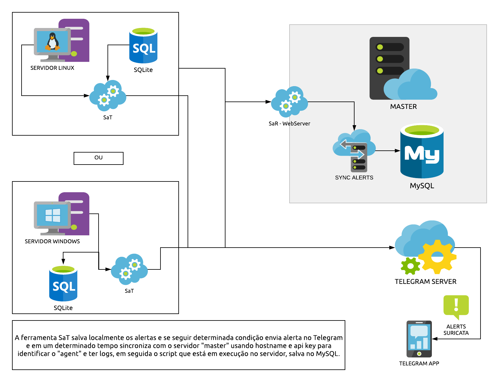

# SaT-WebServer

SaT (Security Alert Tool) é uma ferramenta escrita em Python para ajudar a manter a segurança de servidores, deixando você por dentro de ataque e scanners de hackers na rede com a ajuda da ferramenta SURICATA ou SNORT (funciona com ambos softwares), gerando notificações por meio de um bot no Telegram e armazenando logs mapeados para um banco de dados relacional, facilitando também possíveis analise de dados.

Está extensão da ferramenta funciona como centralizador de informações, é um servidor web (api) feito em o micro-framework [Flask](https://flask.palletsprojects.com/en/1.1.x/) que recebe informações (logs) do agentes e salva em um [MySQL](https://www.mysql.com/) todos os alertas recebidos. Dessa forma evitando o trabalho de ter que verificar os logs de cada nó, já que todos vão ser copiados para um único servidor e o mais importante melhorando o tempo de resposta a incidentes.

### Detalhes técnicos

Para que os agentes consigam enviar informações, assim salvar os logs, eles devem ter um cadastro nesse servidor, caso contrário todas as requisições serão negadas por questão de segurança para evitar ataques.

O banco de dados que faz gerenciamento de usuários é um SQLite, para simplificar
o desenvolvimento e otimizar operações.

### Instalação

dependências do python

* python-dotenv>=0.13.0
* Flask>=1.1.2
* Flask-SQLAlchemy>=2.4.3

para instalar rapidamente basta entrar na raíz do projeto e com pip instalado digitar o comando ``pip install -r requirements.txt``

Para instalar a ferramenta você um banco de dados MySQL, e Python 3.5.* ou superior.

> OBS: (Ubuntu) caso receba um erro ao instalar o mysql connector com pip no ubuntu instale os seguintes pacotes `libmysqlclient-dev`

Após clonar o repositório você precisa criar o banco de dados, schema da tabela, usuário e dar permissão de `select` e `create`. Para isso você deve usar o script `schema.db`.

E por fim configurar copiar o arquivo .env.example para .env e preencher com as informações necessárias.

